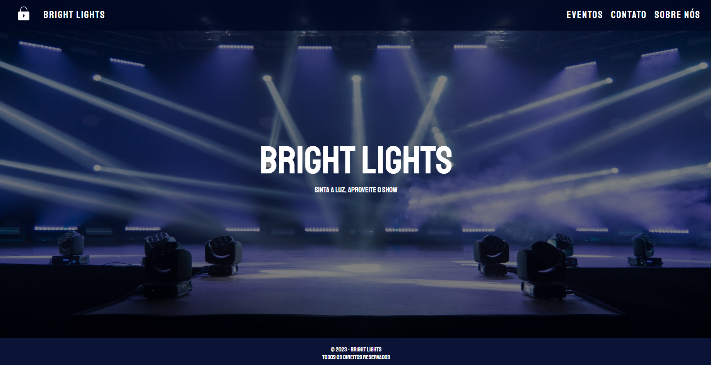

# Projeto Final - Front Dinâmico - Angular II 

O repositório Projeto Final - Front Dinâmico - Angular II, tem como finalidade colocar em prática os conhecimentos adquiridos em aula do módulo de Angular 
O projeto tem como objetivo a criação de uma aplicação web contendo um CRUD com os conceitos vistos em aula.

  

## Como executar
- Clone este repositório em uma pasta local.
- Abra a pasrt do projeto com o Visual Studio Code ou outro editor de texto
- entre na pasta do backend (back) e rode os comandos: npm i, npm start
- em seguida rode os mesmos comandos na pasta do frontend
- caso o banco de dados esteja vazio procure o arquivo "scripts.sql" que fica na pasta "infra" dentro da pasta "back" e execute as linhas 1 a 44;
- a área de admin pode ser acessada com o login "adm" e senha "12345"

